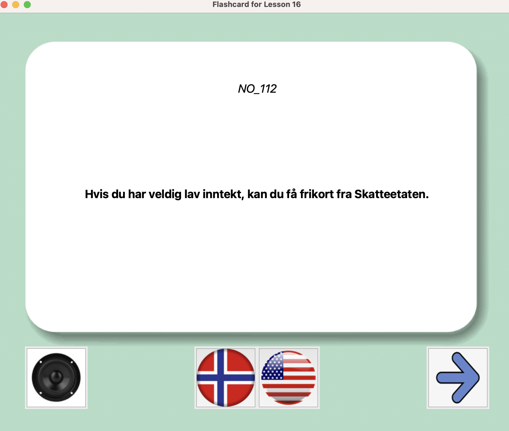
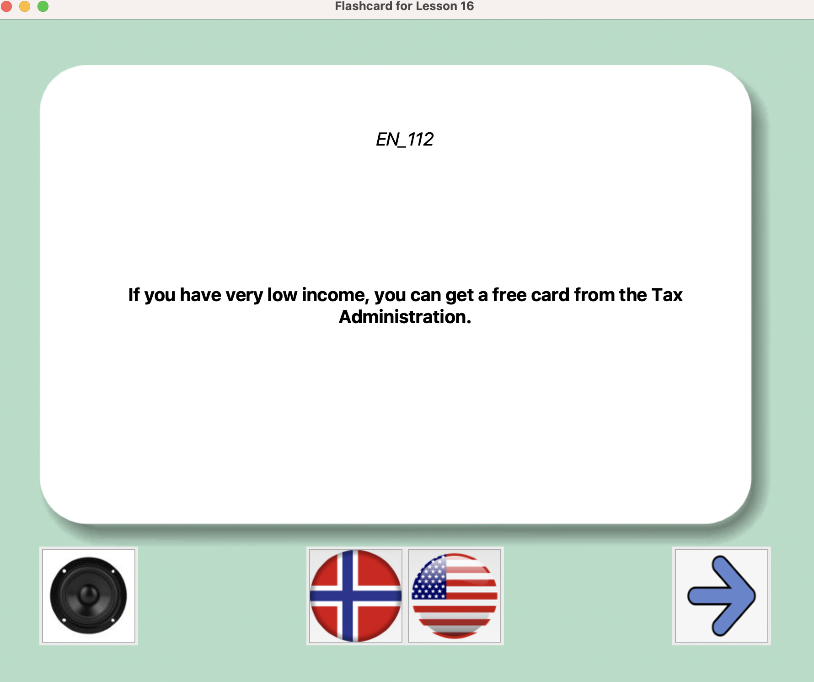

# Norwegian-Flashcard-via-Python

This is a project to learn Norwegian (A2) through flashcards in Python.  
All the conversations in the book `På Vei` (2018) are added here to learn.  
The card can be run sequentially at the first stage to go through all the sentence in order.  
Or it can be run randomly to test the vocab/ word choice/ grammar.   

# Instructions
- Clone/download the repository to your computer as the following steps: 

1. Open the terminal on your computer.
2. Navigate to the directory where you want to clone the repository.
3. Type `git clone https://github.com/Rosienguyen/Norwegian-Flashcard-via-Python.git` and press Enter.

- Run the flashcard `flashcard.py` in your IDE/Terminal.  
1. Make sure that the directory is the path to the repository/folder. 
2. In Terminal, you will type this `python flashcard.py` 
3. There are two questions popping up: 
    - The first one is: Choose between (pavei, stein), you should type either "pavei" or "stein". ie, you type: pavei
    - The second question is: Lesson to study. You should type the lesson you wanna study. i.e 16 and press ENTER  

You'll see a card like this  
 

Click on the Flag icon to see what it is in the language of interest 
For example, click on the USA flag, you will see this:  
 

 
The right arrow icon is for the next card. It can be randomly chose what language the sentence can be displayed. 
The speaker icon is to play the Norwegian sound. 
